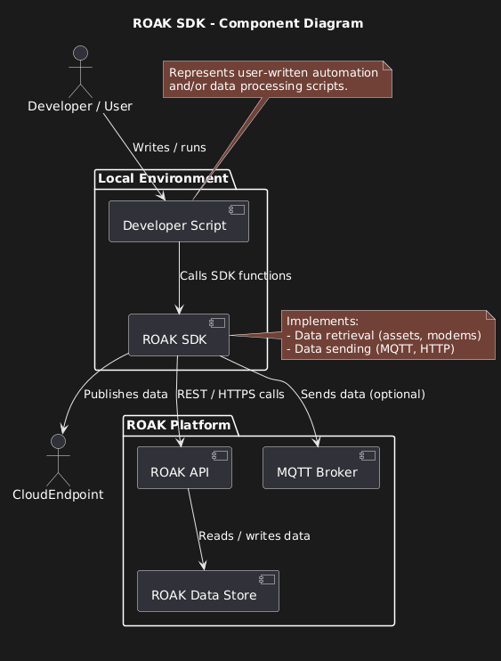
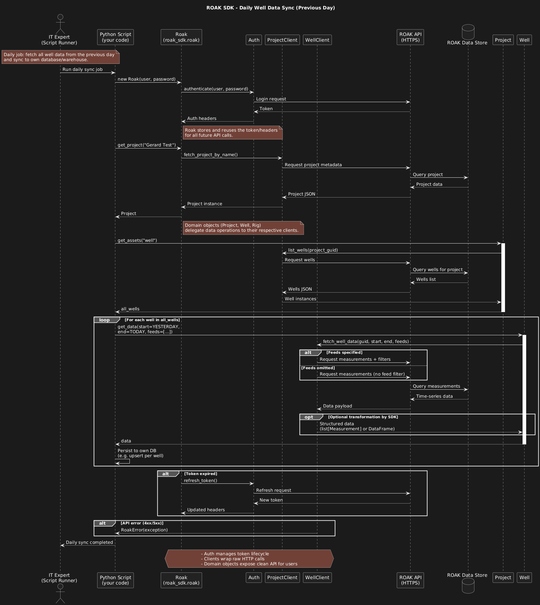

# Index

This Software Guidebook (SGB) describes the design, implementation, and usage of the ROAK SDK.
It is structured so that both technical stakeholders (developers, maintainers) and non-technical stakeholders (supervisors, management) can understand the goal, design choices, and outcomes of the project.

## How to Use This Document

* **If you want to understand the project goal** → Read [Chapter 1: Project Overview](#1-project-overview)
* **If you want to know what the SDK must do** → Check [Chapter 2: Requirements](#2-requirements)
* **If you want to understand the design** → See [Chapter 3: Architecture](#3-architecture), where context, component, sequence, and class diagrams explain how the SDK fits in the ROAK platform and how it is structured internally:
  - [Context Diagram](#context-diagram)
  - [Component Diagram](#component-diagram)
  - [Sequence Diagram](#sequence-diagram)
  - [Class Diagram](#class-diagram)
* **If you want details about the implementation** → Go to [Chapter 4: Implementation Details](#4-implementation-details)
* **If you need to install or test the SDK** → Follow [Chapter 5: Setup & Installation](#5-setup--installation)
* **If you want to use the SDK in your own scripts** → Start with [Chapter 6: Usage Guide](#6-usage-guide)
* **If you want insight into the development workflow** → See [Chapter 7: Development Process](#7-development-process)
* **If you want to know what is planned for the future** → Read [Chapter 8: Future Work / Known Issues](#8-future-work--known-issues)


## Table of Contents

1. [Project Overview](#1-project-overview) – goal, context, and purpose of the SDK.
2. [Requirements](#2-requirements) – functional and non-functional requirements.
3. [Architecture](#3-architecture) – context, component, sequence, and class diagrams with explanations.
4. [Implementation Details](#4-implementation-details) – programming language, structure, dependencies, and environment.
5. [Setup & Installation](#5-setup--installation) – how to install and configure the SDK.
6. [Usage Guide](#6-usage-guide) – examples and explanations of key classes and functions.
7. [Development Process](#7-development-process) – Git workflow, testing strategy, and coding standards.
8. [Future Work / Known Issues](#8-future-work--known-issues) – features to be added and possible improvements


# 1. Project Overview
### 1.1 Project Goal
The goal of this project is to design and implement a Software Development Kit (SDK) for the ROAK data platform.
This SDK will allow developers and customers of Royal Eijkelkamp to easily retrieve and process data. 

### 1.2 Context
This project is part of my internship at HAN University of Applied Sciences with Royal Eijkelkamp. It serves as both an internship assignment and an opportunity to deepen my Python programming skills, as my previous experience was primarily in Java.

### 1.3 Purpose of the SDK
The SDK provides a clear, reusable interface to manage ROAK-connected assets:

- `Project` → groups of assets under a sites in a project
- `Well` → water and pressure measurements  
- `Rig` → drilling rigs and related `Borehole`s  
- `Borehole` → specialized asset that exposes get_depth_data() using the RigClient, returning depth-aligned measurements.
- `GenericAsset` → well like asset type that we dont know yet what it could be

Users do **not** interact directly with the API; the SDK wraps all calls.

### 1.4 Scope

The SDK focuses on retrieving, processing, and eventually sending data to ROAK. It does not cover the internal implementation of the ROAK platform or device firmware.
 
# 2. Requirements
### 2.1 Functional requiments
- The user must be able to retrieve data for all of their assets.
- The user must be able to retrieve data based on the modem serial number.
- Optional: depth data.
- Must be implemented in Python; if there is time, also in other languages 
- Optional: a small investigation with BOOD / R&D about which functions are needed.
- Sending data to ROAK:
   - From devices (MQTTs)
   - From the cloud (HTTPs / AMQPs)

### 2.2 Non-functional requirements (performance, security, compatibility)
#### Performance

- Efficient API usage  
- Quick processing for automated pipelines  

#### Security

- HTTPS for REST, secure MQTT  
- Credentials handled via environment variables  
- No logging of sensitive data  

#### Compatibility

- Python 3.10+  
- Standard Python package (`pip install`)  
- Optional: SDK ports to other languages  

#### Usability

- Meaningful exceptions and error messages  
- Clear documentation and examples  

#### Maintainability

- Follow Python best practices (PEP 8, Black)  
- Unit/integration tests, ≥70% coverage  
- Version control with branching workflow (Gitea)  

# 3. Architecture

## Context diagram


The context diagram shows the SDK at the center, exposing a Python interface to users. Users interact with the SDK to retrieve or send data. The SDK communicates with the ROAK API over secure HTTPS. External assets, such as modems and rigs, are connected via ROAK, and the SDK allows developers to fetch their data.

## Component Diagram



The component diagram shows how the SDK fits into the larger ROAK ecosystem (external connections and high-level structure), whereas the class diagram shows the internal design of the SDK (classes, responsibilities, and relationships). Together, they give a complete picture of architecture.

- Developer / User: Writes Python scripts that import and use the SDK.
- Developer Script: Represents custom automation or data processing logic written by the user.
- ROAK SDK: The software package that provides functions for authentication, fetching well/rig/modem/asset data, and sending data via MQTT or AMQP.
- ROAK API: The primary REST API for retrieving and managing measurement data.
- ROAK Data Store: Backend database that stores measurements, asset information, and metadata.
- MQTT Broker & Cloud Endpoints: Optional integration points for streaming or sending data.

Interactions:
- The script calls the SDK.
- The SDK authenticates and retrieves data through the ROAK API.
- The API communicates with the Data Store to serve results.
- In the future, the SDK may publish data directly to MQTT/Cloud endpoints.
- This diagram emphasizes external connections and shows how the SDK fits within the larger ROAK ecosystem.


## Sequence diagram



## Sequence Diagram Description

This sequence diagram illustrates the daily synchronization workflow using the ROAK SDK. The process begins when the IT expert runs a scheduled script to fetch all well data from the previous day and store it in a local database or data warehouse.

1. **Initialization**  
   The script creates a `Roak` instance with user credentials. The SDK authenticates via the ROAK API, retrieves a token, and stores it for subsequent requests.

2. **Project Retrieval**  
   The script calls `get_project("Gerard Test")`. The SDK delegates this to `ProjectClient`, which queries the ROAK API and returns a `Project` domain object.

3. **Well Listing**  
   Using `project.get_assets("well")`, the SDK fetches all wells associated with the project. Each well is represented as a `Well` object.

4. **Data Fetch Loop**  
   For each well, the script calls `well.get_data(start, end, feeds)`. The SDK uses `WellClient` to request measurements from the ROAK API:
   - If feeds are specified, the request includes filters.
   - If feeds are omitted, all available measurements are returned.  
   The SDK transforms feed-based API responses into timestamp-based records using a pivot step. Users always receive normalized, timestamp-indexed dictionaries.”

5. **Persistence**  
   The script stores the retrieved data in the local database or warehouse.

6. **Error Handling**  
   - If the token expires, the SDK refreshes it automatically.
   - API errors (4xx/5xx) are raised as `RoakError` exceptions.

## Class diagram


### Key Components and Classes

**Auth**
- Handles authentication and token lifecycle.
- Methods:
  - `authenticate(user, password, base_url)` → returns headers for ROAK
  - `get_headers()` → returns headers for authenticated requests

**Roak**
- Top-level SDK interface and entry point.
- Responsibilities:
  - Initializes authentication
  - Provides high-level methods for accessing projects and assets
- Key Methods:
  - `get_project(name)` → returns `Project` or list
  - `get_project_guid(name)` → returns GUID as `str`
  - `get_all_wells(project_guid)` → returns list[`Well`]
  - `get_rig(guid)` → returns `Rig`

**Clients**
- Encapsulate API communication for specific entity types.
- All inherit `BaseClient` for `_request()` and shared HTTP logic.
- Types:
  - **ProjectClient** → fetches `Project` data
  - **WellClient** → fetches `Well` data (`get_well_data`, `fetch_well_data`)
  - **RigClient** → fetches `Rig` and `Borehole` data
  - **AssetClient** → handles generic assets
  - **GenericAssetClient** → specialized client for generic asset operations

**Semantics**
- Groups domain logic and models.
- Includes:
  - **Site** → represents a physical or logical site in ROAK
  - **TimeHelper** → utility for date/time operations (e.g., previous day ranges)

**Assets**
- Domain models representing ROAK entities.
- **Asset** (base class) → common fields (`guid`, `name`, `client`) and `get_data()`
- **Project** → `get_wells()`
- **Well** → `get_data(start, end, feeds)`
- **Rig** → `get_boreholes()`, `get_data()`
- **Borehole** → `get_depth_data(start, end)`,`get_data()`
- **GenericAsset** → placeholder for future asset types

**RoakError**
- Base class for SDK exceptions, ensuring consistent error handling.

-------
## Asset Containment, Hierarchy & Deduplication

The ROAK platform organizes assets using a strict containment hierarchy:

- **Project**
  - Contains one or more **Sites**
- **Site**
  - Contains one or more **Assets**
- **Assets**
  - Specific types such as `Well`, `Rig`, `Borehole`, or `GenericAsset`

### Hierarchy Rules
- Every asset has exactly one parent (Project or Site).
- A `Rig` may contain multiple `Borehole` assets.
- Assets inherit common fields from the base `Asset` class (guid, name, client).

### Deduplication Rules
Because ROAK data may occasionally return duplicates or overlapping entities,  
the SDK enforces cleanup rules:

1. **GUID-based Deduplication**
   - If multiple objects share the same GUID, only one instance is returned.
   - The first occurrence is kept; further duplicates are discarded.

2. **Type-Safe Grouping**
   - Assets are grouped by their semantic type:
     - Wells → `Well` objects  
     - Rigs → `Rig` objects  
     - Boreholes → `Borehole` objects  
   - Unknown types are wrapped in `GenericAsset`.

3. **Parent Linking**
   - The SDK ensures that:
     - Wells belong to the correct Site/Project
     - Boreholes belong to the correct Rig
     - Duplicate cross-links are ignored

4. **Deterministic Ordering**
   - When lists are returned (e.g., all wells), they are sorted by:
     1. Name (case-insensitive)
     2. GUID (fallback)

These rules guarantee that the user receives a clean, stable, predictable asset hierarchy regardless of inconsistencies in raw API responses.

# 4. Implementation Details

### 4.1 Programming language
Python was chosen as its the primary language used at Royal Eijkelkamp mainly version 3.10+
I wil be applying PEP 8 style guidlines and use extensions for formatting.

### 4.2 Project structure
``` python
roak_sdk/
├─ __init__.py              # Marks the package as a Python module
├─ auth.py                  # Authentication and token handling
├─ roak_error.py            # Custom exception classes
├─ roak.py                  # Main SDK interface (Roak class)
├─ time_helper.py           # Utility functions for time/date handling
│
├─ semantics/              
│  ├─ __init__.py           
│  ├─ semantics.py          # Core semantic logic for ROAK entities
│  ├─ site.py               # Site entity and related operations
│  ├─ asset.py              # Parent class of all Assets
│  ├─ project.py            # Project entity and related logic
│  ├─ assets/              
│  │  ├─ __init__.py
│  │  ├─ well.py            # Well entity and data retrieval
│  │  ├─ rig.py             # Rig entity and borehole association
│  │  ├─ borehole.py        # Borehole entity and depth data
│  │  └─ generic_asset.py   # special asset with unknown feeds
│
├─ clients/                 # API clients for interacting with ROAK endpoints
│  ├─ __init__.py
│  ├─ base_client.py        # Request logic and Universial fetch method
│  ├─ project_client.py     # Fetches project-related data
│  ├─ well_client.py        # Fetches well-related data
│  ├─ rig_client.py         # Fetches rig and borehole data
│  ├─ asset_client.py       # Handles asset retrieval
│  └─ generic_asset_client.py # Client for generic asset operations
│
└─ (tests/)                 
```
- ``src/`` contains the main code of the SDK.
- ``tests`` has all the tests inlcuding unit tests and integration test.
- ``requirements.txt`` has all the dependencies to duplicate the enviroment.
- ``setup.cfg`` and ``pyproject.toml`` allows installation with `` pip install -e ``

### 4.3 Dependencies
 Most of these dependencies can be found at requirements.txt
 - pytest
 - requests
 - pytest-cov (optional, for test coverage reporting)
 - python-dotenv (for passwords from .env)
 - unittest (std lib, mix pytest + unittest).
 - (add more later)

### 4.4 Development Environment
The SDK Uses a virtual environment which needs to be enabled during development like so ``.\.venv\Scripts\Activate``.

The project is version controlled via GIT and hosted on Gitea with a dev branch workflow

Above 70% coverage in tests

Integration tests require real ROAK credentials (ROAK_PASSWORD in .env).

env example:
`` env
ROAK_PASSWORD="Yourpassword"
``
### 4.5 Error Handling

The SDK uses a dedicated hierarchy of exceptions to provide clear and consistent error handling.

**Base Exception**
- `RoakError`: All custom SDK errors inherit from this class.

**Authentication Errors**
- `AuthenticationError(status_code, message)`: Raised when login or token refresh fails.
- `MissingPasswordError`: Raised when the environment variable for the user password is missing.
- `MissingTokenError`: Raised when authentication succeeds but the access token is missing.
- `MissingRefreshTokenError`: Raised when a refresh token is required but not available.

**Data / API Errors**
- `InvalidJSONError`: Raised when the API response cannot be parsed as valid JSON.
- `requests.HTTPError`: Raised for any HTTP error status returned by the API.

**Usage Example**

```python
from roak_sdk.roak_error import AuthenticationError, InvalidJSONError
from requests import HTTPError

try:
    data = well.get_data(start, end)
except AuthenticationError as e:
    print(f"Authentication failed: {e}")
except InvalidJSONError as e:
    print(f"Data parsing error: {e}")
except HTTPError as e:
    print(f"HTTP request failed: {e}")
```
### 4.6 Authentication Lifecycle

The ROAK SDK centralizes authentication in the `Auth` class and manages it throughout the SDK via the `Roak` entry point. This ensures secure, consistent, and automated access to the ROAK API.

#### Auth Class Responsibilities

- **Initialization**: Accepts explicit credentials (`user`, `password`) or falls back to environment variables (`ROAK_USERNAME`, `ROAK_PASSWORD`). Raises `MissingPasswordError` if no password is provided.
 Optionally accepts a `base_url` to configure which ROAK environment to connect to.
- **Authenticate**: Sends login request to the ROAK API. Returns headers containing the `Bearer` access token.
  - Raises:
    - `AuthenticationError` if HTTP request fails.
    - `InvalidJSONError` if the API response cannot be parsed.
    - `MissingTokenError` if no access token is returned.
- **Refresh Token**: Uses the refresh token to obtain a new access token without requiring the user password.
  - Raises:
    - `MissingRefreshTokenError` if no refresh token is available.
    - `AuthenticationError`, `InvalidJSONError`, or `MissingTokenError` if refresh fails.

#### Roak SDK Integration

- The `Roak` class initializes an `Auth` instance and immediately authenticates to retrieve headers.
- Headers are then propagated to all clients (`WellClient`, `RigClient`, `ProjectClient`, `AssetClient`) for authorized API requests.
- Provides `refresh_tokens()` method to update the access token across all clients seamlessly.
- The resolved `base_url` is shared across all clients to ensure consistent environment usage.

#### Usage Example

```python
from roak_sdk.roak import Roak
import os

username = "user@example.com"
password = os.getenv("ROAK_PASSWORD")
roak = Roak(user=username, password=password,base_url="https://custom.website.com")

# Access projects
project = roak.get_project("TestProject")

# Refresh tokens manually if needed
roak.refresh_tokens()

# Uses the default production URL:
# https://royaleijkelkamp.roak.com
roak = Roak(user=username, password=password)

# Or explicitly target a custom environment (e.g. DEV / TEST)
roak = Roak(
    user=username,
    password=password,
    base_url="https://dev.roak.com"
)
```
### Notes on Lifecycle

- Automatic token management: Users usually do not need to manually call ``authenticate()`` or manage headers. The SDK handles token retrieval and refresh automatically.

- Client updates: Whenever tokens are refreshed, the ``refresh_tokens()`` method ensures all API clients receive updated headers.

- Error Handling: Any authentication failures propagate exceptions (``AuthenticationError``, ``MissingTokenError``, etc.) that can be caught by the user for retries or logging.

- Security Considerations: Credentials are not stored in code; environment variables are recommended. Tokens are short-lived, and refresh is required to maintain access.

- This lifecycle ensures that authentication is consistent, secure, and integrated with all SDK operations, providing a reliable foundation for all data access methods.

### 4.7 Time Handling Rules

The ROAK SDK supports flexible time handling when fetching data. Users can provide start/end times in multiple formats, and the SDK resolves time ranges internally, including the `time_period` parameter.

#### Accepted Types for Time Parameters

- **`datetime.datetime`** → Direct Python datetime objects
- **`str`** → ISO 8601 formatted strings, e.g., `"2025-12-08T12:00:00"`
- **`int`** → Unix timestamp in milliseconds

Example:

```python
from datetime import datetime

start_dt = datetime(2025, 12, 7, 12, 0)
end_str = "2025-12-08T12:00:00"
end_ts = 1765252800000  # Unix timestamp in ms
```
### Default Behavior
- If ``start``is omitted → last 24 hours (Borehole is a expection starts from 1970)
- If ``end`` is omitted → SDK uses the current time (``datetime.now()``).
- If both are omitted → SDK fetches the most recent data according to ``time_period`` or defaults.

### ``time_period`` Resolution

The ``time_period`` parameter is an alternative way to fetch relative data ranges. Internally:

- It converts the period (e.g., ``"1d"``, ``"7d"``, ``"30m"``) into a start timestamp relative to end (or now if end is None).
- The SDK ensures the start and end values are in the correct type for the API request (usually Unix milliseconds).
- This allows users to fetch "last day", "last hour", or custom intervals without manually calculating datetimes.

``` python
# Fetch data for the last day
data = well.get_data(time_period="1d")

# Fetch data for a custom range
from datetime import datetime, timedelta
start = datetime.now() - timedelta(days=2)
end = datetime.now()
data = well.get_data(start=start, end=end, feeds=["waterLevelReference", "baroTemperature"])
```
### Notes

- The SDK internally normalizes all input types to timestamps for API requests.
- If invalid types are provided, a TypeError is raised.
- Feeds are resolved separately using _resolve_feeds(). If feeds=None, a default STANDARD_FEEDS is used; "ALL" fetches all available feeds from the API.

### 4.8 Feed Resolution Rules

The SDK determines which feeds to request using the internal `_resolve_feeds()` method.  
This ensures consistent behavior across all asset types.

#### Allowed Input Formats
- `None` → Use the asset’s `STANDARD_FEEDS`
- `"ALL"` → Query the API for all available feeds
- `list[str]` → Explicit list of feeds provided by the user

#### Resolution Behavior

1. **feeds=None**
   - If the asset defines `STANDARD_FEEDS`, those are used automatically.
   - If no defaults exist, a `ValueError` is raised.

2. **feeds="ALL"**
   - The SDK calls the client’s `get_feeds()` method.
   - All feeds supported by the asset in ROAK are returned.

3. **feeds=[...]**
   - The list is validated:
     - Unknown feeds are rejected with a clear error.
     - Available feeds are obtained from `get_feeds()`.
     - get_feeds() is always called when feeds is a list (This explains why tests must mock get_feeds())
4. **Invalid Types**
   - Any other type results in `TypeError`.

#### Notes
- Feed resolution happens before any API request.
- Some assets preload available feeds (cached client-side after first lookup).
- Feed lists remain stable throughout the session unless explicitly refreshed.


# 5. Setup & Installation
### Installation
```pip install -e.```

### How to set up virtual environment
Use ``python -m venv .venv`` you can create a venv and you can enable it with ``.\.venv\Scripts\Activate`` make sure to have the correct libraries installed.

### How to run tests
using Pytests you can simply use ```python -m pytest ``` to run all tests
.If you want only unittests or integration tests you can use ```python -m unittest ``` and ```python -m integration``` you can also use `` pytest --cov=roak_sdk tests/ `` to see the coverage of the tests 

# 6. Usage Guide
### Example code snippet
```python
from roak_sdk.roak import Roak
import os
from datetime import datetime, timedelta

TODAY = datetime.today()
YESTERDAY = TODAY - timedelta(days=1)

username = "e.garbov@eijkelkamp.com"
password = os.getenv("ROAK_PASSWORD")
roak = Roak(user=username, password=password , base_url="https://royaleijkelkamp.roak.com")

# Fetch project GUID
project = roak.get_project_guid("TestProject")

# Fetch all wells in project
all_wells = project.get_assets("well")

# Get data from each well with two feeds
for well in all_wells:
    data = well.get_data(
        start=YESTERDAY, end=TODAY, feeds=["waterLevelReference", "diverPressure"]
    )
    print(f"Well {well.name} data: {data}")
```

# 7. Development Process
### Git workflow (branches, commits, pull requests)
Im using the branching strategy from Royal Eijkelkamp using a main branch as stable and a dev branch for ongoing work

Each client (WellClient, RigClient, etc.) has its own unit tests, ensuring modularity and easier maintenance.

### Testing strategy (pytest)
- Test all unit tests 
- Test all integration tests
- Test the coverage for min 70%
- Unit tests mock raw API responses, but assertions are always made on pivoted SDK output. Integration tests validate real API behavior after transformation.

# 8. Future Work / Known Issues
- Support additional SDK languages (Java, C#)
- Add MQTT data sending
- Further testing of token_refresh (Method has only been testing in unit level)
- base_url is not tested (https://royaleijkelkamp.roak.com/ versus dev)