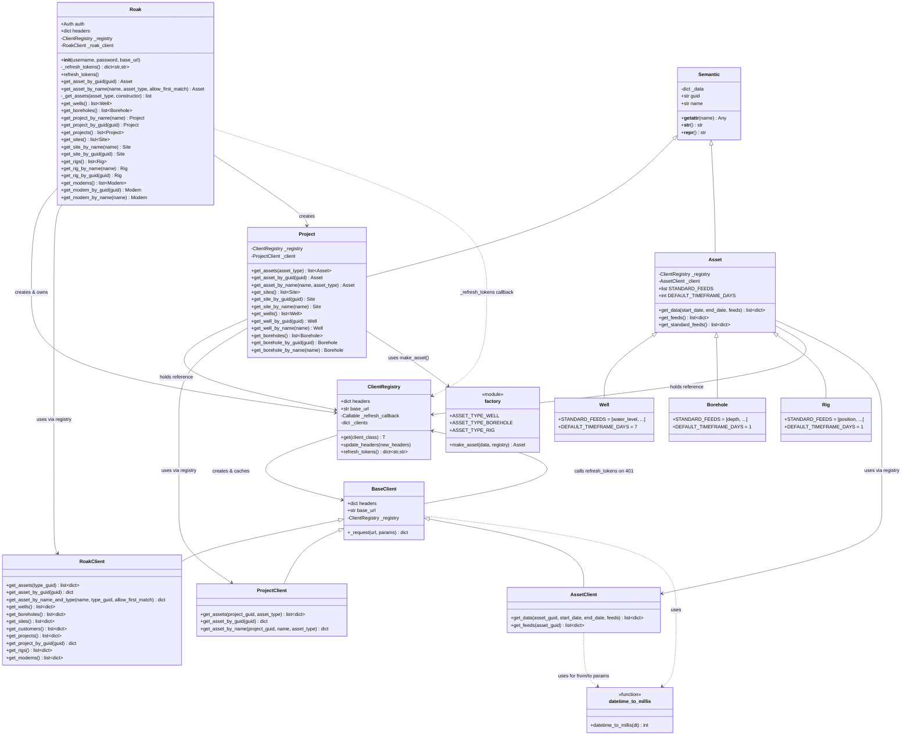
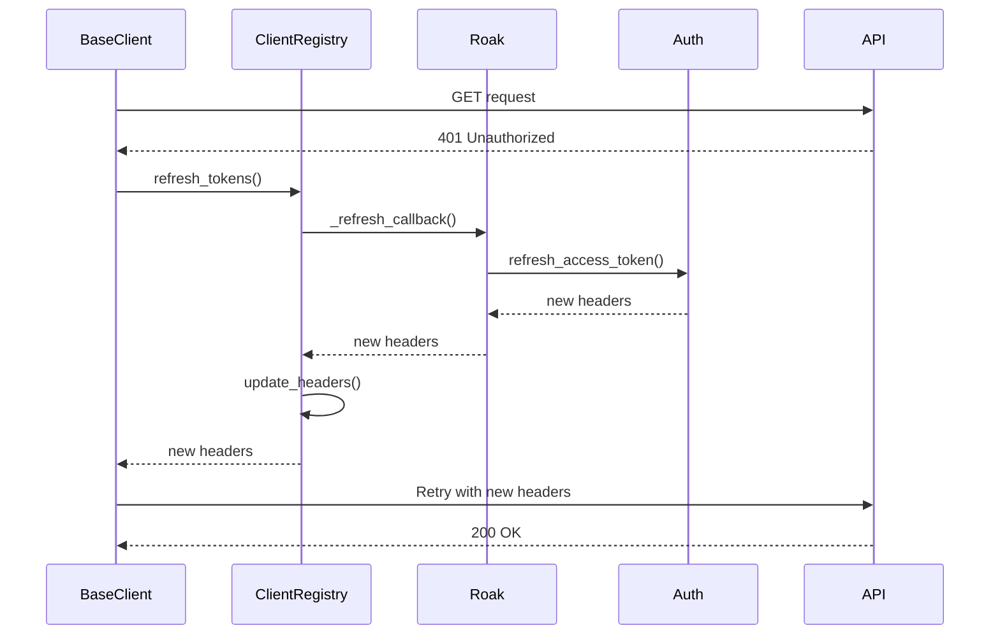

# ROAK SDK Architecture

## Class Diagram

## Token Refresh Flow

## API Surface Notes

- `Project` remains the public scoped container for generic asset listing via `get_assets()`.
- `Roak` now provides direct account-wide lookup methods for generic assets, wells, and boreholes.
- `Roak.get_sites()`, `Roak.get_wells()`, and `Roak.get_boreholes()` share a private `_get_assets(...)` helper backed by `RoakClient.get_assets(type_guid=...)`.
- `make_asset()` currently materializes `Well`, `Borehole`, and generic `Asset`. It does not yet widen generic account-wide list results into `Site`, `Rig`, or `Modem`.